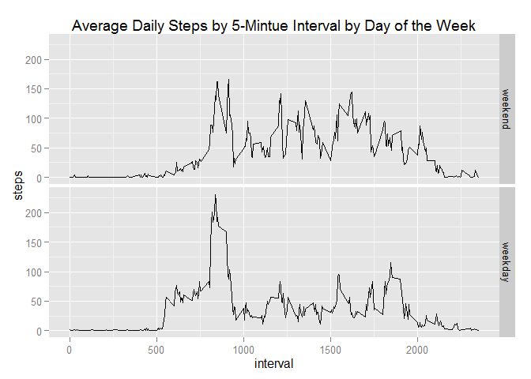

# Reproducible Research: Peer Assessment 1


## Loading and preprocessing the data
Loading the data use read.csv(). The csv file is saved in the activity folder in the directory folder.The variables included in this dataset are:  
- steps: Number of steps taking in a 5-minute interval (missing values are coded as NA)
- date: The date on which the measurement was taken in YYYY-MM-DD format
- interval: Identifier for the 5-minute interval in which measurement was taken
Based the variable discription, the class of each variable should be numeric, date and numeric, respectively. After exploring the data, only date variable needs to be transformed from factor into date. 


```r
# load the data 
data <- read.csv("./activity/activity.csv")
# data exploratory and process
head(data,2)
```

```
##   steps       date interval
## 1    NA 2012-10-01        0
## 2    NA 2012-10-01        5
```

```r
lapply(data,class)
```

```
## $steps
## [1] "integer"
## 
## $date
## [1] "factor"
## 
## $interval
## [1] "integer"
```

```r
totalDays <- length(levels(data$date))
data$date <- as.Date(data$date,format = "%Y-%m-%d")
```


## What is mean total number of steps taken per day?
To analyze steps per day, we will:
- Calculate the total number of steps taken per day
- Make a histogram of the total number of steps taken each day
- Calculate and report the mean and median of the total number of steps taken per day

```r
# calculate total number of steps by date
stepByDay <- aggregate(steps~date,data = data,sum)
# Plot the histogram of total number of steps taken each day and save plots in figure folder
library(ggplot2)
```

```
## Warning: package 'ggplot2' was built under R version 3.1.3
```

```r
png("./figure/Histogram.TotalStepsByDate.png")
p1 <- ggplot(stepByDay,aes(x=steps))
p1 <- p1 + geom_histogram(aes(fill = ..count..))
p1 <- p1 + ggtitle("Histogram - Total Number of Steps per Day Remove NA")
print(p1)
dev.off()
```

```
## png 
##   2
```

```r
print(p1)
```

 

```r
# calculate and report mean and median of the total number of steps taken per day
report1<-aggregate(steps~date,data=data,function(x) c(mean=mean(x,na.rm = TRUE),median=median(x,na.rm = TRUE)))
report1
```

```
##          date steps.mean steps.median
## 1  2012-10-02  0.4375000    0.0000000
## 2  2012-10-03 39.4166667    0.0000000
## 3  2012-10-04 42.0694444    0.0000000
## 4  2012-10-05 46.1597222    0.0000000
## 5  2012-10-06 53.5416667    0.0000000
## 6  2012-10-07 38.2465278    0.0000000
## 7  2012-10-09 44.4826389    0.0000000
## 8  2012-10-10 34.3750000    0.0000000
## 9  2012-10-11 35.7777778    0.0000000
## 10 2012-10-12 60.3541667    0.0000000
## 11 2012-10-13 43.1458333    0.0000000
## 12 2012-10-14 52.4236111    0.0000000
## 13 2012-10-15 35.2048611    0.0000000
## 14 2012-10-16 52.3750000    0.0000000
## 15 2012-10-17 46.7083333    0.0000000
## 16 2012-10-18 34.9166667    0.0000000
## 17 2012-10-19 41.0729167    0.0000000
## 18 2012-10-20 36.0937500    0.0000000
## 19 2012-10-21 30.6284722    0.0000000
## 20 2012-10-22 46.7361111    0.0000000
## 21 2012-10-23 30.9652778    0.0000000
## 22 2012-10-24 29.0104167    0.0000000
## 23 2012-10-25  8.6527778    0.0000000
## 24 2012-10-26 23.5347222    0.0000000
## 25 2012-10-27 35.1354167    0.0000000
## 26 2012-10-28 39.7847222    0.0000000
## 27 2012-10-29 17.4236111    0.0000000
## 28 2012-10-30 34.0937500    0.0000000
## 29 2012-10-31 53.5208333    0.0000000
## 30 2012-11-02 36.8055556    0.0000000
## 31 2012-11-03 36.7048611    0.0000000
## 32 2012-11-05 36.2465278    0.0000000
## 33 2012-11-06 28.9375000    0.0000000
## 34 2012-11-07 44.7326389    0.0000000
## 35 2012-11-08 11.1770833    0.0000000
## 36 2012-11-11 43.7777778    0.0000000
## 37 2012-11-12 37.3784722    0.0000000
## 38 2012-11-13 25.4722222    0.0000000
## 39 2012-11-15  0.1423611    0.0000000
## 40 2012-11-16 18.8923611    0.0000000
## 41 2012-11-17 49.7881944    0.0000000
## 42 2012-11-18 52.4652778    0.0000000
## 43 2012-11-19 30.6979167    0.0000000
## 44 2012-11-20 15.5277778    0.0000000
## 45 2012-11-21 44.3993056    0.0000000
## 46 2012-11-22 70.9270833    0.0000000
## 47 2012-11-23 73.5902778    0.0000000
## 48 2012-11-24 50.2708333    0.0000000
## 49 2012-11-25 41.0902778    0.0000000
## 50 2012-11-26 38.7569444    0.0000000
## 51 2012-11-27 47.3819444    0.0000000
## 52 2012-11-28 35.3576389    0.0000000
## 53 2012-11-29 24.4687500    0.0000000
```


## What is the average daily activity pattern?
To get the daily activity pattern, we make a time series plot of the 5-minute interval (x-axis) and the average number of steps taken, averaged across all days (y-axis).

```r
# calculate the average steps across all day for every 5-minute interval
avgStepByTime <- aggregate(steps~interval,data,mean)
# plot and save the figure
png("./figure/Plot.DailyActivityPattern.png")
p2 <- ggplot(avgStepByTime,aes(x=interval,y=steps))
p2 <- p2 + geom_line()
p2 <- p2 + ggtitle("Average Daily Steps by 5-Mintue Interval")
print(p2)
dev.off()
```

```
## png 
##   2
```

```r
print(p2)
```

 

```r
# get the maximun number of steps interval
avgStepByTime[avgStepByTime$steps == max(avgStepByTime$steps),]$interval
```

```
## [1] 835
```
The maximun average number of steps across all days located on the 835 interval.


## Imputing missing values
Note that there are a number of days/intervals where there are missing values (coded as NA). The presence of missing days may introduce bias into some calculations or summaries of the data.
Firstly, we check how many missing valuse there are in the dataset. There are 2304 rows with missing values in the dataset.

```r
sapply(data,function(x) sum(is.na(x)))
```

```
##    steps     date interval 
##     2304        0        0
```

To fill the missing values, we will use the average steps across all day of the missing value interval. And a new dataset will be created by filling the missing values.

```r
newData <- data
newData$avgStep <- rep(avgStepByTime$steps,totalDays)
newData[is.na(newData$steps),]$steps <- newData[is.na(newData$steps),]$avgStep
```

Make a histogram of the total number of steps taken each day and Calculate and report the mean and median total number of steps taken per day. 

```r
# calculate total number of steps by date
stepByDay <- aggregate(steps~date,data = newData,sum)
# Plot the histogram of total number of steps taken each day and save plots in figure folder
png("./figure/Histogram.TotalStepsByDateFillNA.png")
p3 <- ggplot(stepByDay,aes(x=steps))
p3 <- p3 + geom_histogram(aes(fill = ..count..))
p3 <- p3 + ggtitle("Histogram - Total Number of Steps per Day Fill NA")
print(p3)
dev.off()
```

```
## png 
##   2
```

```r
print(p3)
```

 

```r
# calculate and report mean and median of the total number of steps taken per day
report2<-aggregate(steps~date,data=newData,function(x) c(mean=mean(x),median=median(x)))
report2
```

```
##          date steps.mean steps.median
## 1  2012-10-01 37.3825996   34.1132075
## 2  2012-10-02  0.4375000    0.0000000
## 3  2012-10-03 39.4166667    0.0000000
## 4  2012-10-04 42.0694444    0.0000000
## 5  2012-10-05 46.1597222    0.0000000
## 6  2012-10-06 53.5416667    0.0000000
## 7  2012-10-07 38.2465278    0.0000000
## 8  2012-10-08 37.3825996   34.1132075
## 9  2012-10-09 44.4826389    0.0000000
## 10 2012-10-10 34.3750000    0.0000000
## 11 2012-10-11 35.7777778    0.0000000
## 12 2012-10-12 60.3541667    0.0000000
## 13 2012-10-13 43.1458333    0.0000000
## 14 2012-10-14 52.4236111    0.0000000
## 15 2012-10-15 35.2048611    0.0000000
## 16 2012-10-16 52.3750000    0.0000000
## 17 2012-10-17 46.7083333    0.0000000
## 18 2012-10-18 34.9166667    0.0000000
## 19 2012-10-19 41.0729167    0.0000000
## 20 2012-10-20 36.0937500    0.0000000
## 21 2012-10-21 30.6284722    0.0000000
## 22 2012-10-22 46.7361111    0.0000000
## 23 2012-10-23 30.9652778    0.0000000
## 24 2012-10-24 29.0104167    0.0000000
## 25 2012-10-25  8.6527778    0.0000000
## 26 2012-10-26 23.5347222    0.0000000
## 27 2012-10-27 35.1354167    0.0000000
## 28 2012-10-28 39.7847222    0.0000000
## 29 2012-10-29 17.4236111    0.0000000
## 30 2012-10-30 34.0937500    0.0000000
## 31 2012-10-31 53.5208333    0.0000000
## 32 2012-11-01 37.3825996   34.1132075
## 33 2012-11-02 36.8055556    0.0000000
## 34 2012-11-03 36.7048611    0.0000000
## 35 2012-11-04 37.3825996   34.1132075
## 36 2012-11-05 36.2465278    0.0000000
## 37 2012-11-06 28.9375000    0.0000000
## 38 2012-11-07 44.7326389    0.0000000
## 39 2012-11-08 11.1770833    0.0000000
## 40 2012-11-09 37.3825996   34.1132075
## 41 2012-11-10 37.3825996   34.1132075
## 42 2012-11-11 43.7777778    0.0000000
## 43 2012-11-12 37.3784722    0.0000000
## 44 2012-11-13 25.4722222    0.0000000
## 45 2012-11-14 37.3825996   34.1132075
## 46 2012-11-15  0.1423611    0.0000000
## 47 2012-11-16 18.8923611    0.0000000
## 48 2012-11-17 49.7881944    0.0000000
## 49 2012-11-18 52.4652778    0.0000000
## 50 2012-11-19 30.6979167    0.0000000
## 51 2012-11-20 15.5277778    0.0000000
## 52 2012-11-21 44.3993056    0.0000000
## 53 2012-11-22 70.9270833    0.0000000
## 54 2012-11-23 73.5902778    0.0000000
## 55 2012-11-24 50.2708333    0.0000000
## 56 2012-11-25 41.0902778    0.0000000
## 57 2012-11-26 38.7569444    0.0000000
## 58 2012-11-27 47.3819444    0.0000000
## 59 2012-11-28 35.3576389    0.0000000
## 60 2012-11-29 24.4687500    0.0000000
## 61 2012-11-30 37.3825996   34.1132075
```

```r
# compare the report with removing NA and filling NA
nrow(report1)
```

```
## [1] 53
```

```r
nrow(report2)
```

```
## [1] 61
```

```r
report <- merge(report1,report2,by = "date")
report$compare.mean <- report$steps.x - report$steps.y
report
```

```
##          date steps.x.mean steps.x.median steps.y.mean steps.y.median
## 1  2012-10-02    0.4375000      0.0000000    0.4375000      0.0000000
## 2  2012-10-03   39.4166667      0.0000000   39.4166667      0.0000000
## 3  2012-10-04   42.0694444      0.0000000   42.0694444      0.0000000
## 4  2012-10-05   46.1597222      0.0000000   46.1597222      0.0000000
## 5  2012-10-06   53.5416667      0.0000000   53.5416667      0.0000000
## 6  2012-10-07   38.2465278      0.0000000   38.2465278      0.0000000
## 7  2012-10-09   44.4826389      0.0000000   44.4826389      0.0000000
## 8  2012-10-10   34.3750000      0.0000000   34.3750000      0.0000000
## 9  2012-10-11   35.7777778      0.0000000   35.7777778      0.0000000
## 10 2012-10-12   60.3541667      0.0000000   60.3541667      0.0000000
## 11 2012-10-13   43.1458333      0.0000000   43.1458333      0.0000000
## 12 2012-10-14   52.4236111      0.0000000   52.4236111      0.0000000
## 13 2012-10-15   35.2048611      0.0000000   35.2048611      0.0000000
## 14 2012-10-16   52.3750000      0.0000000   52.3750000      0.0000000
## 15 2012-10-17   46.7083333      0.0000000   46.7083333      0.0000000
## 16 2012-10-18   34.9166667      0.0000000   34.9166667      0.0000000
## 17 2012-10-19   41.0729167      0.0000000   41.0729167      0.0000000
## 18 2012-10-20   36.0937500      0.0000000   36.0937500      0.0000000
## 19 2012-10-21   30.6284722      0.0000000   30.6284722      0.0000000
## 20 2012-10-22   46.7361111      0.0000000   46.7361111      0.0000000
## 21 2012-10-23   30.9652778      0.0000000   30.9652778      0.0000000
## 22 2012-10-24   29.0104167      0.0000000   29.0104167      0.0000000
## 23 2012-10-25    8.6527778      0.0000000    8.6527778      0.0000000
## 24 2012-10-26   23.5347222      0.0000000   23.5347222      0.0000000
## 25 2012-10-27   35.1354167      0.0000000   35.1354167      0.0000000
## 26 2012-10-28   39.7847222      0.0000000   39.7847222      0.0000000
## 27 2012-10-29   17.4236111      0.0000000   17.4236111      0.0000000
## 28 2012-10-30   34.0937500      0.0000000   34.0937500      0.0000000
## 29 2012-10-31   53.5208333      0.0000000   53.5208333      0.0000000
## 30 2012-11-02   36.8055556      0.0000000   36.8055556      0.0000000
## 31 2012-11-03   36.7048611      0.0000000   36.7048611      0.0000000
## 32 2012-11-05   36.2465278      0.0000000   36.2465278      0.0000000
## 33 2012-11-06   28.9375000      0.0000000   28.9375000      0.0000000
## 34 2012-11-07   44.7326389      0.0000000   44.7326389      0.0000000
## 35 2012-11-08   11.1770833      0.0000000   11.1770833      0.0000000
## 36 2012-11-11   43.7777778      0.0000000   43.7777778      0.0000000
## 37 2012-11-12   37.3784722      0.0000000   37.3784722      0.0000000
## 38 2012-11-13   25.4722222      0.0000000   25.4722222      0.0000000
## 39 2012-11-15    0.1423611      0.0000000    0.1423611      0.0000000
## 40 2012-11-16   18.8923611      0.0000000   18.8923611      0.0000000
## 41 2012-11-17   49.7881944      0.0000000   49.7881944      0.0000000
## 42 2012-11-18   52.4652778      0.0000000   52.4652778      0.0000000
## 43 2012-11-19   30.6979167      0.0000000   30.6979167      0.0000000
## 44 2012-11-20   15.5277778      0.0000000   15.5277778      0.0000000
## 45 2012-11-21   44.3993056      0.0000000   44.3993056      0.0000000
## 46 2012-11-22   70.9270833      0.0000000   70.9270833      0.0000000
## 47 2012-11-23   73.5902778      0.0000000   73.5902778      0.0000000
## 48 2012-11-24   50.2708333      0.0000000   50.2708333      0.0000000
## 49 2012-11-25   41.0902778      0.0000000   41.0902778      0.0000000
## 50 2012-11-26   38.7569444      0.0000000   38.7569444      0.0000000
## 51 2012-11-27   47.3819444      0.0000000   47.3819444      0.0000000
## 52 2012-11-28   35.3576389      0.0000000   35.3576389      0.0000000
## 53 2012-11-29   24.4687500      0.0000000   24.4687500      0.0000000
##    compare.mean.mean compare.mean.median
## 1                  0                   0
## 2                  0                   0
## 3                  0                   0
## 4                  0                   0
## 5                  0                   0
## 6                  0                   0
## 7                  0                   0
## 8                  0                   0
## 9                  0                   0
## 10                 0                   0
## 11                 0                   0
## 12                 0                   0
## 13                 0                   0
## 14                 0                   0
## 15                 0                   0
## 16                 0                   0
## 17                 0                   0
## 18                 0                   0
## 19                 0                   0
## 20                 0                   0
## 21                 0                   0
## 22                 0                   0
## 23                 0                   0
## 24                 0                   0
## 25                 0                   0
## 26                 0                   0
## 27                 0                   0
## 28                 0                   0
## 29                 0                   0
## 30                 0                   0
## 31                 0                   0
## 32                 0                   0
## 33                 0                   0
## 34                 0                   0
## 35                 0                   0
## 36                 0                   0
## 37                 0                   0
## 38                 0                   0
## 39                 0                   0
## 40                 0                   0
## 41                 0                   0
## 42                 0                   0
## 43                 0                   0
## 44                 0                   0
## 45                 0                   0
## 46                 0                   0
## 47                 0                   0
## 48                 0                   0
## 49                 0                   0
## 50                 0                   0
## 51                 0                   0
## 52                 0                   0
## 53                 0                   0
```
By removing missing values, we have 53 days data, while filling missing values gives 61 days data. However, comparing the 53 days data, the mean and median each day are the same.


## Are there differences in activity patterns between weekdays and weekends?
Create a new factor variable in the dataset with two levels - "weekday" and "weekend" indicating whether a given date is a weekday or weekend day.

```r
weekdays1 <- c('Monday', 'Tuesday', 'Wednesday', 'Thursday', 'Friday')
newData$wDay <- factor((weekdays(newData$date) %in% weekdays1), levels=c(FALSE, TRUE), labels=c('weekend', 'weekday') )
```

Make a panel plot containing a time series plot (i.e. type = "l") of the 5-minute interval (x-axis) and the average number of steps taken, averaged across all weekday days or weekend days (y-axis). 

```r
# get weekend/weekday data
avgStepByTimeByDay <- aggregate(steps~interval+wDay,newData,mean)
# plot
png("./figure/Plot.DailyActivityPatternbyWDay.png")
p4 <- ggplot(avgStepByTimeByDay,aes(x=interval,y=steps))
p4 <- p4 + geom_line()
p4 <- p4 + ggtitle("Average Daily Steps by 5-Mintue Interval by Day of the Week")
p4 <- p4 + facet_grid(wDay ~ .)
print(p4)
dev.off()
```

```
## png 
##   2
```

```r
print(p4)
```

 
